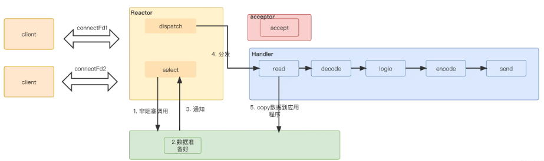

[TOC]

# C++复习
## 语言基础
- 虚函数与多态, 纯虚函数、抽象类，Java中的`interface`。
- \<memory>智能指针 `std::shared_ptr<>`, `std::make_shared<>`等。
- \<functional>函数绑定`std::bind` 占位符`std::placeholders::_1`。
-  大型程序工具－命名空间 `namespace`,`c++11`中`using`新特性别名。

`c++11`中的并发:
- \<thread> 多线程`std::thread t(func, param1, param2)`,`t.join()`,`std::thread t(std::bind(func, param1, param2))`。
- \<mutex>锁`std::mutex`,`std::lock_guard<std::mutex>`。
- \<conditional_variable>条件变量`cv.wait(mutex)` `cv.notify_one(mutex)`。
- \<future> `std::future std::promise`,`std::package_task`
,`std::async`。


## 脚本与库
脚本绑定技术　`boost/python` `SWIG` `pybind11`		

* [awesome-cpp](https://github.com/fffaraz/awesome-cpp) A curated list of awesome C++ (or C) frameworks, libraries, resources, and shiny things.
		
静态库即静态链接库（Windows 下的`.lib`，Linux和Mac下的`.a`）。 		
静态库在编译的时候会被直接拷贝一份，复制到目标程序里，这段代码在目标程序里就不会再改变了。静态库编译完成后，库文件没有作用了。 目标程序无外部依赖可直接运行。 缺点目标程序的体积增大。 		
		
动态库即动态链接库（Windows下的`.dll`，Linux下的`.so`，Mac 下的`.dylib/.tbd`）。与静态库相反，动态库在编译时并不会被拷贝到目标程序中，目标程序中只会存储指向动态库的引用。		
		
Linux创建静态库(C++ API设计343页)
```c++		
g++ -c file.cpp file2.cpp file3.cpp	
ar -crs libmyapi.a file1.o file2.o file3.o	
g++ usercode.cpp -o userapp -L -lmyapi	
./userapp	
```
Linux创建动态库(C++ 后台开发126页)
```c++		
g++ -c file.cpp file2.cpp file3.cpp	
g++ -shared -o libmyapi.so -fPIC file1.o file2.o file3.o	
g++ usercode.cpp -o userapp -L -lmyapi	
```		
程序中调用动态库(C++ API设计347页)	
```c++	
dlopen() dlsym()	
```
## 数据结构与算法
- `Vector` `List` `Stack` `Queue` 
- `Priority queue` `Heap`
-  树 `Binary tree` `Binary serach tree`  
 - 自平衡二叉搜索树: `AVL` `B tree` `Red-black tree`
- `Hashing` `Skip list`
- 排序 `Heapsort` `Mergersort` `Quicksort` `External sort`
- 图 `BFS` `DFS` `Prim`/`Kruskal`
- 贪心 分治 递归与动态规划 回溯

## I/O与并发
### 五大IO模型：
- 阻塞`Blocking`　
- 非阻塞`Non-blocking` 　
- I/O复用`select` `poll` `epoll`
- 信号驱动IO与定时器
- 异步`AIO`

### I/O复用`select` `poll` `epoll`区别

||select|poll|epoll|
|:---|:---|:---|:---|
|底层数据结构|数组|链表|红黑树存储监控fd，双链表存储就绪fd|
|获取就绪fd|遍历fd_set|遍历链表|回调|
|时间复杂度|遍历fd数组，O(n)|遍历fd链表，O(n)|当有就绪事件时，系统注册的回调函数就会被调用，将就绪的fd放入到就绪链表中，O(1)|
|fd数据拷贝|fd数据从用户空间拷贝到内核空间|fd数据从用户空间拷贝到内核空间|使用内存映射(mmap)，fd数据不需从用户空间拷贝到内核空间|
|最大连接数|有限制，一般为1024|无限制|无限制`cat /proc/sys/fs/file-max`|

### 并发模式:
- 事件处理模式`reactor` `proactor`， `libevent` `Java`中的`Netty`
- 池化技术：进程池　线程池　连接池(数据库 HTTPClient)　内存池　对象池


### Reactor模式
非阻塞IO+多路复用整理流程如下：

- select应用程序向系统内核空间,询问数据是否准备好(因为有窗口大小限制，不是有数据，就可以读）,直接返回，非阻塞调用。
- 内核空间中有数据准备好了，发送ready read给应用程序
- 应用程序读取数据，进行decode,业务逻辑处理,最后encode，再发送出去，返回给客户端

上面我们主要是通过非阻塞+多路复用IO来解决局部的select​ 和read​问题。我们再重新梳理下整体流程，看下整个数据处理过程可以如何进行分组。这个每个阶段使用不同的线程池来处理，提高效率。首先事件分两种:
- 连接事件accept动作来处理
- 传输事件select，read,send 动作来处理。

连接事件处理流程比较固定，无额外逻辑，不需要进一步拆分。传输事件 read，send​是相对比较固定的，每个连接的处理逻辑相似，可以放在一个线程池处理。而具体逻辑decode,logic,encode 各个连接处理逻辑不同。整体可以放在一个线程池处理。

服务端拆分成三部分：
- 1.reactor部分，统一处理事件，然后根据类型分发
- 2.连接事件分发给acceptor，数据传输事件分发给handler
- 3.如果是数据传输类型，handler read完再交给processor处理

因为1,2处理都比较快，放在线程池处理，业务逻辑放在另外一个线程池处理。


传统BIO模型　每线程每连接

单Reactor单线程

单Reactor＋线程池

主从Reactor+线程池 


###　池化技术
线程池　内存池　连接池　

## Web组件
|功能模块|组件|架构/IO/线程模型|实现技术|
|:---|:---|:----|:---|
|语言 |Golang Erlang Lua|协程| |
|IO   |epoll|IO复用|红黑树|
|协议|NTP|单线程同步|libevent|
|网络库      |libevent|Reactor|  |
|网络库      |Netty | Reactor|   | 
|web服务器|Nginx|多进程异步|epoll|
|web服务器 |Apache/CGI|每请求每进程|    |
|网关接口|FastCGI|多进程同步| |
|缓存     |Redis|单线程异步|epoll|
|缓存　　　|Memcached|多线程异步|epoll, libevent|

### Libevent与Netty
### 组件Nginx
### 组件Redis与Memcached

[memcached](https://hoverzheng.github.io/post/technology-blog/architect/memcached%E6%9E%B6%E6%9E%84%E5%88%86%E6%9E%90/)


## 设计模式
### Gang of Four Object Oriented Patterns
|      创建型            | 结构性　 | 行为型 　　　|
|:--------------------: | :------: | :------: |
|Abstrct Factory抽象工厂  |Adapter适配器   　|Chain of Responsibility责任链　　　|
|Builder建造者           | Bridge桥接　　　　|Commond命令　　　|
|Factory Method工厂   | Composite组合    | Interpeter解释器    |
|Prototype 原型　　　　　　|Decorator装饰器　　|Iterator迭代器|
| Singleton单例　　　　　　|Facade外观　　　　 |Mediator中介者|　　
| 　　　　　　　　　　　　　|　Flyweight享元　  |Memento备忘录|
| 　　　　　　　　　　　　　|Proxy代理　  　　　 |Observer观察者|　　
|                       |                 |    State状态        |
|                       |                 |  Strategy策略          |　
|                       |                 |  Template Method模板方法|　
|                       |                 |  Visitor访问者          |　

### Concurrency Patterns
`Active object` `Balking` `Binding properties` `Double-checked locking` `Event-based asynchronous` `Guarded suspension` `Join` `Lock` `Monitor` `Proactor` `Reactor` `Read write lock` `Scheduler` `Thread pool` `Thread-local storage`

### Architectural Patterns
`Front controller` `Interceptor` `MVC` `ADR` `ECS` `n-tier` `Specification` `Publish–subscribe` `Naked objects` `Service locator` `Active record` `Identity map` `Data access object` `Data transfer object` `Inversion of control` `Model 2`

# ROS2基础
ROS1的核心是一个基于master中心节点的匿名发布-订阅通信中间层，ROS2采用基于RTPS(Real-Time Publish-Subscribe)协议的DDS作为中间层，DDS(Data-Distribution Service)是一种用于实时和嵌入式系统发布-订阅式通信的工业标准，这种点到点的通信模式类似于ROS1的中间层，但是DDS不需要像ROS1那样借由master节点来完成两个节点间通信，这使得系统更加容错和灵活。

多个厂商提供多种DDS实现，一般来说DDS的底层通信机制基于UDP协议或者共享内存机制（当然也有厂商提供基于TCP的DDS实现），而ROS2支持多种DDS实现，用户可以根据实际情况选择DDS中间层，目前来说ROS2 Foxy完整支持以下DDS中间层：

- eProsima的Fast RTPS（当前ROS2版本默认的DDS实现）
- RTI的Connext DDS
- Eclipse Cyclone DDS

## ROS2架构
如下:

ROS2的内部接口主要包括两个层：
- rmw (ros middleware interface): 相对底层的接口层，直接和DDS交互，C语言实现
- rcl (ros client libraries): 对rmw相对高层的抽象，c/c++实现

ROS2中的QoS策略:
ROS2中引入了Quality of Service, QoS(服务质量)的策略用于配置节点间通信，进而提升了ROS2适应于不同应用场景的灵活性。ROS1只支持基于TCP的通信，通过配置QoS，ROS2可以表现出TCP的可靠性，也可以表现出UDP那样的高实时性。用户可以通过选择不同的QoS配置文件以实现不同的通信表现，QoS配置文件为策略的集合，ROS2提供了预设的QoS配置文件，如下所示：

- 发布-订阅机制的QoS设定
- 服务（Service）的QoS设定
- 传感器数据的QoS设定
- 参数的QoS设定
- DDS中间层默认的QoS设定

## 创建ROS2节点
### 创建python功能包
创建一个名字叫做village_li (李家村)python版本的功能包。
```shell
ros2 pkg create village_li --build-type ament_python --dependencies rclpy
```

- pkg create 是创建包的意思
- --build-type 用来指定该包的编译类型，一共有三个可选项`ament_python`、`ament_cmake`、`cmake`
- --dependencies 指的是这个功能包的依赖，这里小鱼给了一个ros2的python客户端接口`rclpy`

在`__init__.py`同级别目录下创建一个叫做li4.py的文件.
### 非OOP方法编写一个python节点
``` python
import rclpy
from rclpy.node import Node

def main(args=None):
    """
    ros2运行该节点的入口函数
    编写ROS2节点的一般步骤
    1. 导入库文件
    2. 初始化客户端库
    3. 新建节点对象
    4. spin循环节点
    5. 关闭客户端库
    """
    rclpy.init(args=args) # 初始化rclpy
    node = Node("li4")  # 新建一个节点
    node.get_logger().info("Hello I'm li4.")
    rclpy.spin(node) # 保持节点运行，检测是否收到退出指令（Ctrl+C）
    rclpy.shutdown() # 关闭rclpy
```
代码编写完成用Crtl+S进行保存。接着修改`setup.py`

增加一句话，告诉ros2村庄来了一位新村民李四，要找这位村民去`village_li.li4:main`路径下寻找。
```python
  entry_points={
        'console_scripts': [
            "li4_node = village_li.li4:main"
        ],
    },
)
```
进入`~/myros$`下编译:
```shell
colcon build 或 colcon build --packages-select village_li
source install/setup.bash
ros2 run village_li li4_node
```


### OOP方法编写一个python节点
打开`li4.py`,接着我们开始修改代码。
```python
#!/usr/bin/env python3
import rclpy
from rclpy.node import Node


class WriterNode(Node):
    """
    创建一个作家节点，并在初始化时输出一个话
    """
    def __init__(self,name):
        super().__init__(name)
        self.get_logger().info("大家好，我是%s,我是一名作家！" % name)


def main(args=None):
    """
    ros2运行该节点的入口函数
    1. 导入库文件
    2. 初始化客户端库
    3. 新建节点
    4. spin循环节点
    5. 关闭客户端库
    """
    rclpy.init(args=args) # 初始化rclpy
    node = WriterNode("li4")  # 新建一个节点
    rclpy.spin(node) # 保持节点运行，检测是否收到退出指令（Ctrl+C）
    rclpy.shutdown() # 关闭rclpy
```
同样的方法编译运行

### 创建c++功能包
```shell
ros2 pkg create village_wang --build-type ament_cmake --dependencies rclcpp
```
###  非OOP方法编写c++节点并测试
```c++
#include <memory>
#include "rclcpp/rclcpp.hpp"

int main(int argc, char *argv[])
{
    rclcpp::init(argc, argv);
    /*产生一个Wang2的节点*/
    auto node = std::make_shared<rclcpp::Node>("wang2");
    // 打印一句自我介绍
    RCLCPP_INFO(node->get_logger(), "Hello I'm wang2.");
    /* 运行节点，并检测退出信号*/
    rclcpp::spin(node);
    rclcpp::shutdown();
    return 0;
}
```
主函数中首先初始化`rclcpp`，然后新建了一个`Node`节点的对象，命名为`wang2`，接着使用`rclcpp`让这个节点暴露在外面，并检测退出信号（Ctrl+C），检测到退出信号后，就会执行`rcl.shutdown()`关闭节点。

修改一下`CmakeLists.txt`,在`CmakeLists.txt`最后一行加入下面两行代码。
```shell
add_executable(wang2_node src/wang2.cpp)
ament_target_dependencies(wang2_node rclcpp)
```
添加这两行代码的目的是让编译器编译`wang2.cpp`这个文件，不然不会主动编译。接着在上面两行代码下面添加下面的代码。
```shell
install(TARGETS
  wang2_node
  DESTINATION lib/${PROJECT_NAME}
)
```
这个是`C++`比`Python`要麻烦的地方，需要手动将编译好的文件安装到`install/village_wang/lib/village_wang`下.
编译运行结果如下


###  OOP方式编写一个c++节点
```c++
#include <string>
#include <memory>
#include "rclcpp/rclcpp.hpp"

/*
    创建一个类节点，名字叫做SingleDogNode,继承自Node.
*/
class SingleDogNode : public rclcpp::Node
{

public:
    // 构造函数,有一个参数为节点名称
    SingleDogNode(std::string name) : Node(name)
    {
        // 打印一句自我介绍
        RCLCPP_INFO(this->get_logger(), "Hello I'm %s.",name.c_str());
    }

private:
   
};

int main(int argc, char **argv)
{
    rclcpp::init(argc, argv);
    /*产生一个Wang2的节点*/
    auto node = std::make_shared<SingleDogNode>("wang2");
    /* 运行节点，并检测退出信号*/
    rclcpp::spin(node);
    rclcpp::shutdown();
    return 0;
}
```
## Topic编程
Topic通信模型是一种发布订阅模型
### Topic相关工具
`rtq_graph`查看节点和节点之间的数据关系
```shell
ros2 run demo_nodes_py listener
ros2 run demo_nodes_cpp talker
rqt_graph
```


```shell
ros2 topic list -t /*罗列话题列表*/
ros2 topic echo /chatter /*打印话题内容*/
ros2 topic info  /chatter /*查看主题信息*/
ros2 interface show std_msgs/msg/String　/*查看消息类型*/
ros2 topic pub /chatter std_msgs/msg/String 'data: "123"'/*手动发布消息内容*/
```

### Topic编程之python实现
创建作家这个类`WriterNode`的时候让其继承`Node`，具备如下能力：
- 创建一个话题发布者的能力 `self.create_publisher()`
- 创建一个定时器的能力 `self.create_timer()`
- 创建一个话题订阅者的能力`self.create_subscription()`
- 获取日志打印器的能力 `self.get_logger().info()`
- `c++`中为`this->create_publisher()`等
```python
#! /usr/bin/env python3
import rclpy
from rclpy.node import Node
from std_msgs.msg import String,UInt32

class WriterNode(Node):
    def __init__(self, name):
        super().__init__(name)
        self.get_logger().info("Hello, I'm %s, I'm a writer"%name)
        self.pubnovel = self.create_publisher(String, "hero_legend", 10)
 
        self.i = 0
        timer_period = 5
        self.timer = self.create_timer(timer_period, self.timer_callback)

        self.account = 80
        self.submoney = self.create_subscription(UInt32, "hero_legend_money", self.recv_money_callback, 10)
    """
    ros2 topic list -t
    topic hero_legend
    type String
  
    topic hero_legend_money
    type Uint32
    calback func recv_money_callback
    """
    def timer_callback(self):
        msg = String()
        msg.data = "The %d chapter, %d hero"%(self.i, self.i)
        self.pubnovel.publish(msg)
        self.get_logger().info('li4: I\'ve published hero legend:"%s"'%msg.data)
        self.i += 1

    def recv_money_callback(self, money):
        self.account += money.data
        self.get_logger().info('li4: I received %d money'%self.account)

def main(args = None):
    rclpy.init(args=args)
    node = WriterNode("li4")
    rclpy.spin(node)
    rclpy.shutdown()
```
编译`village_li`这个包
```shell
colcon build --packages-select  village_li
source install/setup.bash
ros2 run village_li li4_node
```
打开另一个终端，通过命令行发布话题数据
```shell
ros2 topic pub /hero_legend_money std_msgs/msg/UInt32 "{data: 10}"
```

我们通过`/hero_legend_money`话题向`li4`付钱。

### Topic编程之c++实现
这一小节我们用c++编写`wang2`节点订阅`hero_legend`话题，并支付稿费。
```c++
#include "std_msgs/msg/string.hpp"
#include "std_msgs/msg/u_int32.hpp"
```
添加对应的消息类型头文件：
```c++
#include <string>
#include <memory>
#include <functional>

#include "rclcpp/rclcpp.hpp"
#include "std_msgs/msg/string.hpp"
#include "std_msgs/msg/u_int32.hpp"

using std::placeholders::_1;
using std::placeholders::_2;

class SingleDogNode : public rclcpp::Node
{
public:
    SingleDogNode(std::string name) : Node(name){
        RCLCPP_INFO(this->get_logger(), "Hello, I'm %s", name.c_str());
        
        sub_novel = this->create_subscription<std_msgs::msg::String>("hero_legend", 10, 
    std::bind(&SingleDogNode::topic_callback, this, _1));
        
        pub_money = this->create_publisher<std_msgs::msg::UInt32>("hero_legend_money", 10);
    }
private:
    rclcpp::Subscription<std_msgs::msg::String>::SharedPtr sub_novel;
    rclcpp::Publisher<std_msgs::msg::UInt32>::SharedPtr pub_money;

    void topic_callback(const std_msgs::msg::String::SharedPtr msg){
        std_msgs::msg::UInt32 money;
        money.data = 5;
        pub_money->publish(money);
        RCLCPP_INFO(this->get_logger(), "I have read: '%s', give li4 %d money", msg->data.c_str(), money.data);
    }
};

int main(int argc, char *argv[])
{
    rclcpp::init(argc, argv);
    auto node = std::make_shared<SingleDogNode>("wang2");

    rclcpp::spin(node);
    rclcpp::shutdown();
    return 0;
}
```
在C++中创建一个订阅者，需要传入话题类型、话题名称、所要绑定的回调函数，以及通信Qos。`std::bind()`:　C++的类成员函数不能像普通函数那样用于回调，因为每个成员函数都需要有一个对象实例去调用它。 通常情况下，要实现成员函数作为回调函数：一种过去常用的方法就是把该成员函数设计为静态成员函数（因为类的成员函数需要隐含的this指针 而回调函数没有办法提供），但这样做有一个缺点，就是会破坏类的结构性，因为静态成员函数只能访问该类的静态成员变量和静态成员函数，不能访问非静态的，要解决这个问题，可以把对象实例的指针或引用做为参数传给它。 后面就可以靠这个对象实例的指针或引用访问非静态成员函数。另一种办法就是使用`std::bind`和`std::function`结合实现回调技术。


## 自定义接口

```shell
ros2 interface list //接口列表（当前环境下）
ros2 interface packages //查看所有接口包
ros2 interface package sensor_msgs //查看接口包下所有的接口
ros2 interface show std_msgs/msg/String //查看某一个接口详细的内容
ros2 interface proto sensor_msgs/msg/Image //输出某一个接口所有属性
```
话题-Topics 服务-Services 动作-Action 参数-Parameters.除了参数之外，话题、服务和动作(Action)都支持自定义接口
话题接口格式：`xxx.msg` 
```shell
int64 num
```
服务接口格式：`xxx.srv`
```shell
int64 a
int64 b
---
int64 sum
```
动作接口格式：`xxx.action`
```shell
int32 order
---
int32[] sequence
---
int32[] partial_sequence
```
通过ROS2的IDL模块 产生了python py文件和c++ hpp头文件。

### 自定义话题接口
```shell
ros2 pkg create village_interfaces --build-type ament_cmake 
```
新建msg文件夹和Novel.msg(小说消息)
```shell
mkdir -p village_interfaces/msg && touch Novel.msg
cat village_interfaces/msg/Novel.msg
string content
sensor_msgs/Image image
```
修改CMakeLists.txt，把Novel.msg转换成Python库和C++的头文件，直接添加下面的代码到CMakeLists.txt即可。
```cmake
#添加对sensor_msgs的
find_package(sensor_msgs REQUIRED)
find_package(rosidl_default_generators REQUIRED)
#添加消息文件和依赖
rosidl_generate_interfaces(${PROJECT_NAME}
  "msg/Novel.msg"
   DEPENDENCIES sensor_msgs
 )
```
修改`package.xml`，添加如下：
```xml
  <depend>sensor_msgs</depend>
  <build_depend>rosidl_default_generators</build_depend>
  <exec_depend>rosidl_default_runtime</exec_depend>
  <member_of_group>rosidl_interface_packages</member_of_group>
```
编译
```shell
colcon build --packages-select village_interfaces
```
通过`ros2 interface`命令来测试自定义接口。
```shell
ros2 interface package village_interfaces
ros2 interface show village_interfaces/msg/Novel
ros2 interface proto village_interfaces/msg/Novel
```


## Service编程
### Service常用工具与接口自定义
```shell
ros2 run examples_rclpy_minimal_service service
ros2 service list //查看服务列表
ros2 service call /add_two_ints example_interfaces/srv/AddTwoInts "{a: 5,b: 10}" //另起终端手动调用服务
ros2 service type /add_two_ints　//查看服务接口类型
ros2 service find example_interfaces/srv/AddTwoInts //查找使用某一接口的服务
```
创建srv文件夹及`BorrowMoney.srv`,`SellNovel.srv`消息文件
```shell
mkdir -p village_interfaces/srv && touch BorroMoney.srv
cat BorroMoney.srv
string name
uint32 money
---
bool success
uint32 money

cat SellNovel.srv
uint32 money
---
string[] novels
```
修改CMakeLists.txt,之前我们已经添加过依赖DEPENDENCIES和msg文件了，所以这里我们直接添加一个srv即可。
```shell
find_package(rosidl_default_generators REQUIRED)
rosidl_generate_interfaces(${PROJECT_NAME}
  #---msg---
  "msg/Novel.msg"
  #---srv---
  "srv/BorrowMoney.srv"
  DEPENDENCIES sensor_msgs
)
```
修改`package.xml`,之前我们已经添加过了，这里就不用添加了。
```xml
<build_depend>sensor_msgs</build_depend>
<build_depend>rosidl_default_generators</build_depend>
<exec_depend>rosidl_default_runtime</exec_depend>
<member_of_group>rosidl_interface_packages</member_of_group>
```
编译
```shell
colcon build --packages-select village_interfaces
```
测试


### Service编程之python实现
#### 服务端
- 1.导入服务接口
- 2.创建服务端并定义服务回调函数
- 3.编写回调函数逻辑处理请求

1.导入服务接口，village_li是包类型是ament_python这里只需要在package.xml中加入下面的代码即可：
```xml
  <depend>village_interfaces</depend>
```
打开`li4.py`，在文件开头加入下面一行代码:
```python
from village_interfaces.srv import BorrowMoney
```
2.创建服务端并定义服务回调函数
```python
self.borrow_server = self.create_service(BorrowMoney, "borrow_money", self.borrow_money_callback)
```
需要传入三个参数：
服务接口类型，BorrowMoney，
服务名称，"borrow_money"，具有唯一性，自己手打的
回调函数，self.borrow_money_callback，我们下一步定义的:

3.编写回调函数逻辑处理请求：
request 是客户端请求对象，携带着来自客户端的数据，其结构就是上一节中我们所定义的name和money组成

response 是服务端响应，返回服务端的处理结果，其结构由success和money组成
```python
def borrow_money_callback(self, request, response):
    self.get_logger().info("receive request from %s, at present the account hs %d"%(request.name, self.account))
    if request.money <= int(self.account * 0.1):
        response.success = True
        response.money = request.money
        self.account -= request.money
        self.get_logger().info("Successfully lend %d, account remain %d"%(response.money, self.account))
    else:
        response.success = False
        response.money = 0
        self.get_logger().info("Sorry account not enough")
    return response
```
账户初始金额为80元，不超过10%借钱成功。
完整代码为：
```python
#! /usr/bin/env python3
import rclpy
from rclpy.node import Node
from std_msgs.msg import String,UInt32
from village_interfaces.srv import BorrowMoney

class WriterNode(Node):
    def __init__(self, name):
        super().__init__(name)
        self.get_logger().info("Hello, I'm %s, I'm a writer"%name)
        self.pubnovel = self.create_publisher(String, "hero_legend", 10)
     
        self.i = 0
        timer_period = 5
        self.timer = self.create_timer(timer_period, self.timer_callback)

        self.account = 80
        self.get_logger().info("My initial account is %d, I can lend up to 10 percent of my account"%self.account)
        self.submoney = self.create_subscription(UInt32, "hero_legend_money", self.recv_money_callback, 10)
        self.borrow_server = self.create_service(BorrowMoney, "borrow_money", self.borrow_money_callback)
    """
    正式编译时请删除
    ros2 topic list -t
    topic hero_legend
    type String

    topic hero_legend_money
    type Uint32
    calback func recv_money_callback

    ros2 service list 
    /borrow_money
    /li4/describe_parameters
    /li4/get_parameter_types
    /li4/get_parameters
    /li4/list_parameters
    /li4/set_parameters
    /li4/set_parameters_atomically

    """
    def timer_callback(self):
        msg = String()
        msg.data = "The %d chapter, %d hero"%(self.i, self.i)
        self.pubnovel.publish(msg)
        self.get_logger().info('li4: I\'ve published hero legend:"%s"'%msg.data)
        self.i += 1

    def recv_money_callback(self, money):
        self.account += money.data
        self.get_logger().info('li4: I received %d money'%self.account)

    def borrow_money_callback(self, request, response):
        self.get_logger().info("receive request from %s, at present the account hs %d"%(request.name, self.account))
        if request.money <= int(self.account * 0.1):
            response.success = True
            response.money = request.money
            self.account -= request.money
            self.get_logger().info("Successfully lend %d, account remain %d"%(response.money, self.account))
        else:
            response.success = False
            response.money = 0
            self.get_logger().info("Sorry account not enough")
        return response

def main(args = None):
    rclpy.init(args=args)
    node = WriterNode("li4")
    rclpy.spin(node)
    rclpy.shutdown()
```
编译运行：
```shell
colcon build --packages-select village_li
source install/setup.bash
ros2 run village_li li4_node
```
另起终端以`li3`的名义借钱5元成功：
```shell
source install/setup.bash
ros2 service call /borrow_money village_interfaces/srv/BorrowMoney  "{name: 'li3', money: 5}"
```
以`li2`名义借钱50元失败：
```shell
ros2 service call /borrow_money village_interfaces/srv/BorrowMoney  "{name: 'li2', money: 50}"
```

`li4`节点的响应


#### 客户端:
编写服务通信的客户端的一般步骤：
- 导入服务接口
- 创建请求结果接收回调函数
- 声明并创建客户端
- 编写结果接收逻辑
- 调用客户端发送请求

1.导入服务接口
创建`li3.py`，因与`li4.py`在同一个包`village_li`内,所以不需要再次修改`package.xml`，导入对应接口。
```python
from village_interfaces.srv import BorrowMoney
```
2.创建请求结果接收回调函数
```python
def borrow_respoonse_callback(self,response):
    """
    借钱结果回调
    """
    pass
```
3.创建客户端并定义结果回调函数
```python
class BorrowNode(Node):
#在__init__函数中创建一个服务的客户端
self.borrow_money_client_ = self.create_client(BorrowMoney, "borrow_money")
```
创建客户端使用函数`self.create_client`该函数有两个入口参数，一个是服务接口类型，一个是服务名称。

4.编写结果回调函数处理逻辑
```python
def borrow_response_callback(self, response):
        result = response.result()
        if result.success == True:
            self.get_logger().info("Successfully borrowed %d"%result.money)
        else:
            self.get_logger().info("can't borrow money from server")
```
5.编写发送请求逻辑并修改`main`函数
```python
def borrow_money_eat(self):
        self.get_logger().info("I want to borrow to eat")
        #check service every 1.0 second
        while not self.borrow_client.wait_for_service(1.0):
            self.get_logger().warn("server not online")
        #construct a request
        request = BorrowMoney.Request()
        request.name = self.get_name()
        request.money = 5
        #async call service
        self.borrow_client.call_async(request).add_done_callback(self.borrow_response_callback)
```
修改`main`函数
```python
def main(args = None):
    rclpy.init(args=args)
    node = BorrowNode("li3")
    node.borrow_money_eat()
    rclpy.spin(node)
    rclpy.shutdown()
```

最后编译，`setup.py`文件中添加`li3_node`入口
```python
 entry_points={
        'console_scripts': [
           "li4_node = village_li.li4:main",
           "li3_node = village_li.li3:main"
        ],
    },
)
```
如果编译失败可能是`python3`中`setuptools`的版本过所致，`setup.cfg`文件中`script_dir`,`install_scripts`改为用下划线。
```python
sudo apt-get install python3-pip
python3 -m pip install setuptools==58.2.0

[develop]
script_dir=$base/lib/village_li
[install]
install_scripts=$base/lib/village_li
```
借用5元，通过


借10元，不通过


客户端完整代码如下:
```python
import rclpy
from rclpy.node import Node
from std_msgs.msg import String, UInt32
from village_interfaces.srv import BorrowMoney

class BorrowNode(Node):
    def __init__(self, name):
        super().__init__(name)
        self.get_logger().info("Hello, I'm %s"%name)

        self.borrow_client = self.create_client(BorrowMoney, "borrow_money")

    def borrow_response_callback(self, response):
        result = response.result()
        if result.success == True:
            self.get_logger().info("Successfully borrowed %d"%result.money)
        else:
            self.get_logger().info("can't borrow money from server")
    
    def borrow_money_eat(self):
        self.get_logger().info("I want to borrow to eat")
        #check service every 1.0 second
        while not self.borrow_client.wait_for_service(1.0):
            self.get_logger().warn("server not online")
        #construct a request
        request = BorrowMoney.Request()
        request.name = self.get_name()
        request.money = 10
        #async call service
        self.borrow_client.call_async(request).add_done_callback(self.borrow_response_callback)


def main(args = None):
    rclpy.init(args=args)
    node = BorrowNode("li3")
    node.borrow_money_eat()
    rclpy.spin(node)
    rclpy.shutdown()
```
### Service编程之c++实现
`zhang3`拿多少钱给`wang2`，`wang2`凑够多少个章节的英雄传奇给他。
#### 服务端
创建c++服务通信服务端的步骤
- 1.导入服务接口
- 2.创建服务端回调函数
- 3.实例化服务端并编写回调函数处理请求

1.导入服务接口
修改`package.xml`，添加
```xml
 <depend>village_interfaces</depend>
```
修改`CMakeLists.txt`，添加
```cmake
find_package(village_interfaces REQUIRED)

ament_target_dependencies(wang2_node 
  rclcpp 
  village_interfaces
)
```
添加`SellNovel.srv`生成的头文件`/install/village_interfaces/srv/sell_novel.hpp`
```c++
#include "village_interfaces/msg/novel.hpp"
#include "village_interfaces/srv/sell_novel.hpp"
```
2.创建服务端回调函数
```c++
void sell_book_callback(const village_interfaces::srv::SellNovel::Request::SharedPtr request,
    const village_interfaces::srv::SellNovel::Response::SharedPtr response)
```
存书的队列（可以理解为书库）
```c++
std::queue<std::string> novels_queue;
```
ROS2中要使用多线程执行器和回调组来实现多线程，我们先在SingleDogNode中声明一个私有回调组成员变量。
```c++
// 声明一个服务回调组
rclcpp::CallbackGroup::SharedPtr callback_group_service_;
```

3.实例化服务端并编写回调函数处理请求
在`private:`下声明服务端
```c++
rclcpp::Service<village_interfaces::srv::SellNovel>::SharedPtr server_;

//在构造函数中实例化服务端
server_ = this->create_service<village_interfaces::srv::SellNovel>("sell_novel",
            std::bind(&SingleDogNode::sell_book_callback, this, _1, _2),
            rmw_qos_profile_services_default,callback_group_service_);

//在private:中编写私有回调函数void sell_book_callback()
```
最后修改main函数

服务端`wang2.cpp`完整代码如下：
```c++
#include <string>
#include <queue>
#include <memory>
#include <functional>

#include "rclcpp/rclcpp.hpp"
#include "std_msgs/msg/string.hpp"
#include "std_msgs/msg/u_int32.hpp"
#include "village_interfaces/msg/novel.hpp"
#include "village_interfaces/srv/sell_novel.hpp"


using std::placeholders::_1;
using std::placeholders::_2;

class SingleDogNode : public rclcpp::Node
{
public:
    SingleDogNode(std::string name) : Node(name){
        RCLCPP_INFO(this->get_logger(), "Hello, I'm %s", name.c_str());
        
        sub_novel = this->create_subscription<std_msgs::msg::String>("hero_legend", 10, 
            std::bind(&SingleDogNode::topic_callback, this, _1));
        
        pub_money = this->create_publisher<std_msgs::msg::UInt32>("hero_legend_money", 10);
    
        callback_group_service_ = this->create_callback_group(rclcpp::CallbackGroupType::MutuallyExclusive);

        server_ = this->create_service<village_interfaces::srv::SellNovel>("sell_novel",
            std::bind(&SingleDogNode::sell_book_callback, this, _1, _2),
            rmw_qos_profile_services_default,callback_group_service_);
    }


private:
    rclcpp::Subscription<std_msgs::msg::String>::SharedPtr sub_novel;
    rclcpp::Publisher<std_msgs::msg::UInt32>::SharedPtr pub_money;
    rclcpp::CallbackGroup::SharedPtr callback_group_service_;
    rclcpp::Service<village_interfaces::srv::SellNovel>::SharedPtr server_;
    std::queue<std::string> novels_queue;
    

    void topic_callback(const std_msgs::msg::String::SharedPtr msg){
        std_msgs::msg::UInt32 money;
        money.data = 5;
        pub_money->publish(money);
        RCLCPP_INFO(this->get_logger(), "I have read: '%s', give li4 %d money", msg->data.c_str(), money.data);
        novels_queue.push(msg->data);
    }

    void sell_book_callback(const village_interfaces::srv::SellNovel::Request::SharedPtr request,
    const village_interfaces::srv::SellNovel::Response::SharedPtr response){
        RCLCPP_INFO(this->get_logger(), "Received a request %d to buy book", request->money);
        unsigned int novelsNum = request->money/2;

        if(novels_queue.size() < novelsNum){
            RCLCPP_INFO(this->get_logger(),"The stock of Hero Legend is %d, not enough", novels_queue.size());
            rclcpp::Rate loop_rate(1);
            while(novels_queue.size() < novelsNum){
                if(!rclcpp::ok()){
                    RCLCPP_ERROR(this->get_logger(), "Servr terminated");
                    return ;
                }
                RCLCPP_INFO(this->get_logger(), "waiting,already %d, remaining %d", novels_queue.size(), novelsNum-novels_queue.size());
                loop_rate.sleep();
            }
        }
        RCLCPP_INFO(this->get_logger(), "Current Hero Legend stock is %d, can serve", novels_queue.size());
        
        for(unsigned int i = 0; i < novelsNum; i++){
            response->novels.push_back(novels_queue.front());
            novels_queue.pop();
        }
    }
};

int main(int argc, char *argv[])
{
    rclcpp::init(argc, argv);
    auto node = std::make_shared<SingleDogNode>("wang2");
    rclcpp::executors::MultiThreadedExecutor exector_;
    exector_.add_node(node);
    exector_.spin();
    
    rclcpp::shutdown();
    return 0;
}
```
编译运行，手动发送买书请求，2元一本
```shell
ros2 service call /sell_book  village_interfaces/srv/SellNovel "{money: 5}"
```
我们并没有买到书，因为`wang2`这里也没有，这时候就需要我们来启动`li4`节点来写书了。

`wang2`收到请求，开始没书，后来满足手动请求,并支付给`li4`书钱，5元一本

手动请求满足


#### 客户端
编写客户端张三
- 1.导入服务接口
- 2.创建请求函数和回调函数
- 3.声明并创建客户端并编写请求回调逻辑
- 4.调用客户端发送请求

1.导入服务接口
创建c++包
```c++
ros2 pkg create village_zhang --build-type ament_cmake --dependencies rclcpp
```
修改`package.xml`,添加如下：
```xml
<depend>village_interfaces</depend>
```
修改`CMakeLists.txt`，添加如下：
```cmake
find_package(village_interfaces REQUIRED)

add_executable(zhang3_node src/zhang3.cpp)
ament_target_dependencies(zhang3_node
  rclcpp 
  village_interfaces
)

install(TARGETS
  zhang3_node
  DESTINATION lib/${PROJECT_NAME}
)
```
2.创建请求函数和回调函数
```c++
void buy_novel()//请求函数
void novels_callback(rclcpp::Client<village_interfaces::srv::SellNovel>::SharedFuture response)//回调函数
```
3.声明并创建客户端并编写请求回调逻辑
```c++
rclcpp::Client<village_interfaces::srv::SellNovel>::SharedPtr client_;
```
4.调用客户端发送请求
```c++
auto node = std::make_shared<ReaderNode>("zhang3");
node->buy_novel();
```
完整代码如下：
```c++
#include <string>
#include <memory>
#include <chrono>
#include <functional>

#include "rclcpp/rclcpp.hpp"
#include "village_interfaces/srv/sell_novel.hpp"

using std::placeholders::_1;

class ReaderNode : public rclcpp::Node{
public:
    ReaderNode(std::string name) : Node(name){
        RCLCPP_INFO(this->get_logger(), "Hello I'm %s", name.c_str());
        client_ = this->create_client<village_interfaces::srv::SellNovel>("sell_novel");
    }

    void buy_novel(){
        RCLCPP_INFO(this->get_logger(), "I want to buy novel Hero Legend");

        while(!client_->wait_for_service(std::chrono::seconds(1)))
        {
            if(!rclcpp::ok()){
                RCLCPP_ERROR(this->get_logger(),"waited service interrupted ");
                return ;
            }
            RCLCPP_INFO(this->get_logger(), "waiting for service");
        }

        auto request = std::make_shared<village_interfaces::srv::SellNovel_Request>();
        request->money = 25;
        client_->async_send_request(request, std::bind(&ReaderNode::novels_callback, this, _1));
    }

    void novels_callback(rclcpp::Client<village_interfaces::srv::SellNovel>::SharedFuture response){
        auto result = response.get();
        RCLCPP_INFO(this->get_logger(), "received %d chapter novel", result->novels.size());

        for(std::string novel:result->novels){
            RCLCPP_INFO(this->get_logger(), "read %s", novel.c_str());
        }
        RCLCPP_INFO(this->get_logger(), "novel readed end.");
    }

private:
    rclcpp::Client<village_interfaces::srv::SellNovel>::SharedPtr client_;

};

int main(int argc, char *argv[])
{
    rclcpp::init(argc, argv);
    auto node = std::make_shared<ReaderNode>("zhang3");
    node->buy_novel();
    rclcpp::spin(node);
    rclcpp::shutdown();
    return 0;
}
```


## 参数与Action编程
参数是节点的一个配置值，编译运行节点之后可通过参数改变其配置值而无需在源代码中修改重新编译。
### 参数工具
```shell
ros2 param list //查看节点有哪些参数（设置）

ros2 param describe <node_name> <param_name> //查看一个参数的信息
ros2 param describe /turtlesim background_b

ros2 param describe <node_name> <param_name>//查看参数值
ros2 param get /turtlesim background_b 

ros2 param set <node_name> <parameter_name> <value> //设置参数
ros2 param set /turtlesim background_r 44
ros2 param set /turtlesim background_g 156
ros2 param set /turtlesim background_b 10

ros2 param dump <node_name> //保存参数，生成yaml格式文件
ros2 param dump /turtlesim
ros2 param load /turtlesim ./turtlesim.yaml　//恢复，导入保存参数
```
### 参数编程之python实现
|函数名称|	描述|
|:--------------------: | :------: | 
|declare_parameter	|声明和初始化一个参数|
|declare_parameters|	声明和初始化一堆参数|
|get_parameter	|通过参数名字获取一个参数|
|get_parameters	|通过多个参数名字获取多个参数|
|set_parameters|	设置一组参数的值|

### 参数编程之c++实现
修改`wang2.cpp`，设置小说价格参数`novel_price`
构造函数中声明
```c++
this->declare_parameter<std::int32_t>("novel_price",novel_price);
```
私有回调函数`void sell_book_callback()`中获取参数
```c++
this->get_parameter("novel_price", novel_price);
unsigned int novelsNum = int(request->money/novel_price);
```

#　常用组件，建模与仿真
## launch启动与TF坐标变换
## URDF建模
## rviz可视化与Gazebo仿真

#　感知、模型压缩与部署
##　图像识别、分割与跟踪
Yolo FasterRCNN SSD MobileNet

## 模型压缩与部署
深度学习模型压缩
###　GPU平台
　　TesnorRT
###　手机平台
ARM Neon并行优化
腾讯NCNN 　	
ONNX	Open Neural Network Exchange

###　Intel平台
OpenVINO

#　SLAM同时定位与建图
非线性优化库`ceres.solver`,`g2o`,`gtsam`
SLAM算法`cartographer`
#  规划与控制


`PID`,`MPC`
# STM32嵌入式

# 基于ROS2的Autoware.Auto Cyberdog

